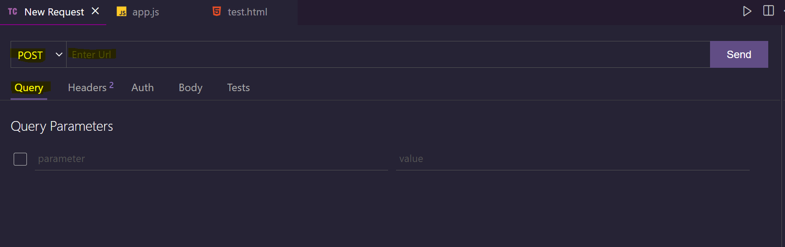
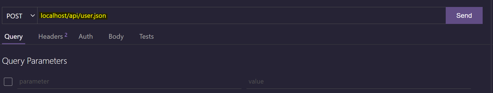
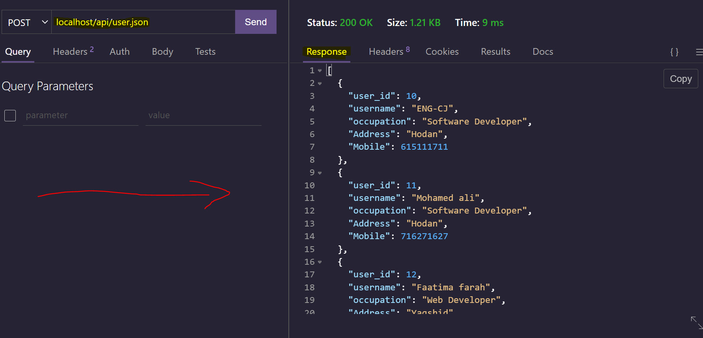
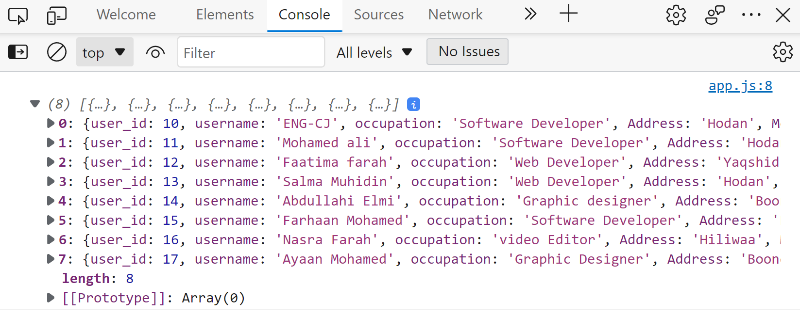
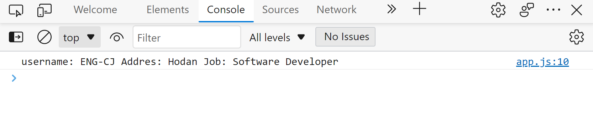

Qeeybtaan Waxaan uga Hadli Doonna <kbd>API</kbd> Waxa Uu yahay, Faa'idadiisa Iyo Isticmaal-kiisa
Waa ka Qeeyb Qadan Kartaa Repository-gaan Adigoo Fork dhahayo Kuna Soo Darso, Waxyaabaha Kamaqan Messhan
Oo Aad isleedahay Dadka Way Anfici Donnan.

# 1. Waa Maxay APi ?
API waxa laga soo gaabiyay <kbd>application programming interface </kbd> <br>
Waa Xarig (Link) udhaxeeya application-kaaga iyo application kale kaaso u sahlaya application-kaaga
inuu la hadlo ama xog kasoo qaato application kale  oo external ah <br>
Tusaalaha API-gu waxaa kamid <kbd>Weather App-ka</kbd> Teelkaaga Kujira Sida Uu Usoo Aqrisanaayo
Cimilada Wadankeena<br>
API isagoo animation ah hoos ayaa ka arki kartaa.<br>


# Waaa Maxay Faa'idada Uu Leeyahay API-gu?
faa'idooyinka ugu muhiimsan ee uu leeyahay api-gu waa<br>
 <ul>
	<li>Inuu Waqtiga Kuu Save-gareeyo</li>
	<li>Inuu Sare Uqaado productivity-ga Application-kaaga</li>
	<li>Inuu Kuu Sahlo Waxyaabaha Developing-kooda Waqti Qadanayo Inaad Si Fudud Ku Hesho</li>
</ul>
 <br>Iyo Faa'idooyin kale Oo Badan

# API METHODS ( Methods-ka Lagu Maamulo API-ka)

4-method Ayaa ugu Muhiimsa API's-ka Waana Kuwaan Soo Socda<br>

1. <kbd>GET</kbd>: GET Waa Method Kamid API Methods Waxuuna Udhigmaa (Read) Wuxuu Kuu Sahlayaa
Inaad hesho Ama soo Aqriso Xogta Kaaga Imaaday Ama Aad kasoo jiidatay Link API.<br>
2. <kbd>POST</kbd>: POST Wuxuu Udhigmaa (Insert Ama Create) Waxaa La isticmaala
 Marka Xog Aad Gelinaysid API-ga
 3. <kbd>PUT</kbd> : POUT Wxuu Udhigmaa ( Update ) Waxaa la isticmaala Markii Xog Aad ka Update-gareenaysid
API-ga <br>
4. <kbd>DELETE</kbd>: Sida Erayga Ka Muuqataba DELETE Waxaa La isticmaala Markii Aad Xog ka Tuuraysid API-ga<br>


# Sidee Ugu Xeraysaa API Website-kaaga Ama App-kaaga?
1. Marka Hore Waa Inaad Heshaa API-ka Aad Rabto Inaad Ku Xerto Website-kaaga Kaba
Soo Qaad Waxaa Rabtaa Inaad Sameeyso Weather Website First Waa Inaad Heshaa API aad ka Heli Karto
Cimiloyin-ka Dunida oo Dhan Kadib Markaad hesho <br>
2. Waa Inaad heshaa Authrization <kbd>API KEY</kbd> : API KEY waa Furaha Kuu Sahlaya inaad Isticmaasho
API-ga Aad Rabto Inaad Xogta kasoo Qaadato Markaad Key-gaas Hesho kadib<br>
3. Aqri Documentation-ka API-gu Wax Walbo Waxay Leeyihiin Tixraac marka Aqri Tixraaca API-ga Aad 
Isticmaalaysid Si Aaadan Ugu Wareerin intaa Kadib
4. Codsiga Dirso (Request Endpoints) Inaad Codsi Udirsato API-ga Aad Isticmaalaysid Si aad U hesho Xogta 
Kujirto Server-kaas <br>
5. Sidaas Ayaa Ugu Xertay Congrats!😊

# Luqad Walba Maku Isticmaali karaa?
Haa Luqad Walba Waa Ku Isticmaali Kartaa, Luuqad Walbana Waxay Leedahay Functional ugooni Ah Oo Lagu
Maamulo API's-ka <br> Examples-ka Soo Socdo Waxaan isticmaali donna <b> JavaScript </b> Luqaadda Favorite-kaaga waa
Isticmaali kartaa ☺


# API using JavaScript
Waxaan Halkaan Ku Arki Donna sida api request loogu dirsado annago isticmaalayno
luuqadda javaScript, Waxaan request udirsan doonaa file local ah oo computer-ka kujiro oo 
lagu magacaabo <kbd>users.json</kbd> Xogta Kujirta Ayaan Kasoo Aqrin donna annago isticmaalayno <kbd>api request</kbd> sidoo kale file-ka waa json xogta kujirto api-gu markii aad request udirsato wuxuu kuusoo celin doonaa data udiyaarsan qaab <kbd>object ah</kbd> marka waa inaad ubadashaa <kbd>JSON</kbd> si aan u test gareeyno api-ga waxaan 
isticmaali donna extension aad ka helaysid VS-CODE oo lagu magacaabo <kbd>thunder client api</kbd>.
Waxaa La isticmaala Markii Aad Api Request Udirsanayso Dhowr Qaabo
1. Inaad Isticmaasho <kbd> fetch </kbd> Method ();
2. Inaad isticmaasho <kbd>AJAX & JQUERY</kbd>
3. XHR Request ama Inaad Isticmaasho <kbd>ASYNC AWAIT</kbd>
<br>
Intaas Qaab Waa Isticmaali Kartaa Lkn Annaga Examples-ka Waxaan isticmaali donna Laba Qaab
1. Fetch
2. PHP -> AJAX AND JQUERY

# API USING JAVASCRIPT |2| fetch Graphical Interface Using thunder API Extension
Marka Hore Install Soo dhaho Extension-ka <kbd>thunder Client api</kbd> 
Inteface-kiisa Kowaad Qaabkaan Ayuu Usoo Bixi Doonaa 👇🏼


Qeeybta Ay Ku Qoranatahy Local Host ayaa waxaa gelinaysaa link-ga request-ga aad diraysid 
annaga hadda waxaan diraynaa request local ah waxaa udiraynaa file-ka <kbd>user.json</kbd>
file-kaas path-kiisa ayaan soo copy-gareeyn donna kadib waxaan ka hormarinayaa localhost maadama aan isticmaalyn
api online ah sidaan ayuu uqorman doonaa path-ka <kbd>localhost/api/user.json</kbd>
Sawir-ka kore Qeeybtiisa Url-ka Ayaa Waxaa Gelinaysa link-ga Aad request Udiraysid


kadib markii aad gelisid waxa soo laaban doono waxaa loo yaqaanaa <kbd>Response</kbd> <br> File-ka Hadda Aan Udirnay
Request-ga Sidaan Ayaa Noqonayaa reponsise-giisa


Sidaas Ayaa Ku TEST Gareeyn kartaa Request Aad Udirtay Link-api local ama Online midkuu doono ha noqdee
adigoo isticmaalaya graphical extension-ka THUNDER CLIENT API 

# API USING JAVASCRIPT |3| By Code Using (fetch method)
Halkaan Waxaan Ku Diraynaa request-gii hadda isagoo code ah ayaan arkaynaa waxaana isticmaali doonna fetch method <br>code-ka sidaan ayuu noqonayaa
```javascript
function FetchMyApi() {
    
    // fetching data from user.json file 
    fetch("./user.json")
    // if it true then change the data response into json format
    .then(response=>response.json())
    // then display the data  to the console
    .then(data=> console.log(data))
    // if it false display the error to the console
    .catch(error=> console.log(error.message));
}
FetchMyApi();
```
sidaas ayaa ku dirsanay api-ga annago isticmaalayno fetch method <br>
waxaa uyeeraysaa method-ka <kbd>fetch(url)</kbd><br> Url : waxaa weeyan link-ga aad udiraysid request-ga<br>
reuqest-ga waxaa kasoo laabanayo laba midkood true ama false<br> <b>true</b>: true hadday tahay data-da
waxaa weeyan wax cillad ah majiraan kadib , data-da Qaar sida aan horay ugu soo sheegnay waxay ku imaanaysa qaab\
object ah si aad ugu badashid json markii data-da true tahay waxaa la isticmaala <kbd>.then</kbd><br> : .then
waxaa weyaan markii data-da success tahay maxaa la qabanaayaa <br><kbd>.catch</kbd>: Waxaa weeyan markii data-da
failed tahay maxaa la qabanayaa <br>then waxaan soo bandhigaynaa error-ka jira lets test
and see the console.....<br>
result:



si aad data-da qeeyb kamid ah ugula soo dhax-baxdid waxaa isticmaalysa indexing <br>
example : <kbd>data[0]</kbd> data[0]: means waa object-ga kowwad xogtiisa isoo bandhig
```javascript
function FetchMyApi() {
    
    // fetching data from user.json file 
    fetch("./user.json")
    // if it true then change the data response into json format
    .then(response=>response.json())
    // then display the data  to the console
    .then(data=> {
        
        console.log(data[0])
    })
    // if it false display the error to the console
    .catch(error=> console.log(error.message));
}
FetchMyApi();
```
haddii aad rabtid user-ka hogtiisa qeeyb kamid Waxaa marka hore accessing ku sameenaysa index-ga object uu leeyhy, 
kadib waxaa isticmaali kartaa <kbd>Ditructure</kbd> : waa vanilla javascript syntax oo aad u isticmaali karto
inaad wixii isku meel ah object varibale usameeyn kartid<br> example haddii aan rabo user-ka ugu horeeyo 
username-kisa address-kiisa iyo shaqadisaa maxaan sameenayaa sidaan...
```javascript
function FetchMyApi() {
    
    // fetching data from user.json file 
    fetch("./user.json")
    // if it true then change the data response into json format
    .then(response=>response.json())
    // then display the data  to the console
    .then(data=> {
        let {username, Address,occupation}=data[0];
        console.log("username: "+username+" Addres: "+Address+" Job: "+occupation);
    })
    // if it false display the error to the console
    .catch(error=> console.log(error.message));
}
FetchMyApi();

```
<kbd>let {username, Address,occupation}=data[0];</kbd> Qeybtaan ayaa loo yaqaanaa distructure 
data[0] waa user-ka ugu horeeyo xogtiisa,  user-ka ugu horeeyana xogtiisa waxaa kamid waxyaabaha
aan object-gaan ku sheegay <kbd>{username, Address,occupation}</kbd> , Waa inay islahaadan magacyada aad halkaan ku qoraysid <kbd>{username, Address,occupation} </kbd> iYo Magacyada data[0] kujiraan ama object-ga aad xogta kasoo qaadanaysid , hadday islahaan waayan waxaa kuu soo laaban doono <kbd>undefined</kbd><br>
Let's Test above the code and see the result


<br>
<br>
Sidaa Ayaa Udirsan kartaa API REQUEST ADIGOO ISTICMAALAYA JAVASCRIPT<br>
GAAB
::::::::::::::::::::::::::::::<br>
fecth : waa method la isticmaalo si request api lo diro<br>
url : url waa link-ga aad udirsanaysid request-ga <br>
.the : waa marka data-da success tahay waxa lasoo bandhigaayo<br>
.catch : waa marka data-da failed tahay waxa lasoo bandhigaayo<br>

thats it😊 Next waxaa fiirin donna ajax jquery php and mysql
